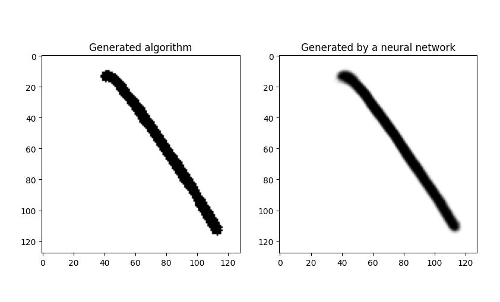
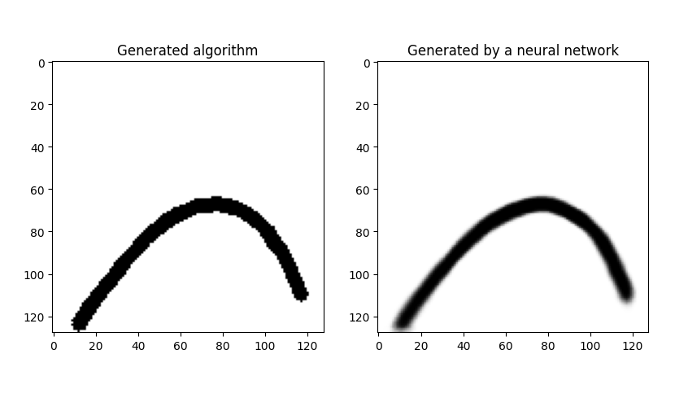

# bizier_curves

## О проекте
Первый проект со стажировки в отдел компьютерного зрения в 2020 году. 
В рамках проекта нужно было спроектировать нейронную, генерирующую изображение кривой Безье по 3 заданным точкам.

## Результаты
Спроектированная нейронная сеть при должном обучение позволяет генерировать 
кривые Безье очень близкие к математическим. 

Пример обученной сети данными настройками:

`THICKNESS=5`, `DIVISIONS=25`, `LAYERS=6`, `FILTERS=256`, `KERNEL_SIZE=3`, `EPOCHS=200`, `STEPS_PER_EPOCH=100`

